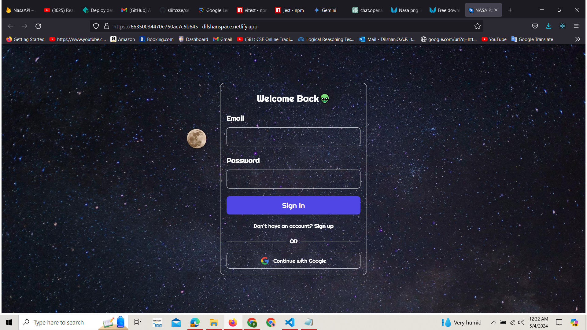

[](https://classroom.github.com/a/V1F4A3D5)

# Dilshan.O.A.P. <br> IT21302480


<p align="center">
  
</p>

## 1. Application Setup. <br> 2. Build Process. <br> 3. Usage Instructions. <br> 4. Chosen APIs. <br> 5. Any challenges faced.

### This is the hosted link (NETLIFY)👽

Click [NASA API site](https://66350034470e750ac7c5b645--dilshanspace.netlify.app/) to visit the website.

## 1. Application Setup.🦾
1. Install nodemodules and below test packages

```bash
npm i
npm i jest
npm install react-scripts
npm install msw
npm list @testing-library/react
```
2. Run the project
```bash
npm run dev
```

3. Run the tests
```bash
npm run test
```
## 2. Build Process.⚡
Using nasa API register and take the API key.<br>
Build the normal react project.<br>
Firebase authentication with session management.<br>
Reat vite, Tailwind css.<br>

## 3. Usage Instructions. ⚠️
Have to login for the system (Use email and password or Google authentication.)
After one hour the session will be expire.

## 4. Chosen APIs.👾
APOD <br>
EPIC <br>
MARS ROVER <br>
EARTH


> Welcome to the Space.

<p align="center">
  
</p>

